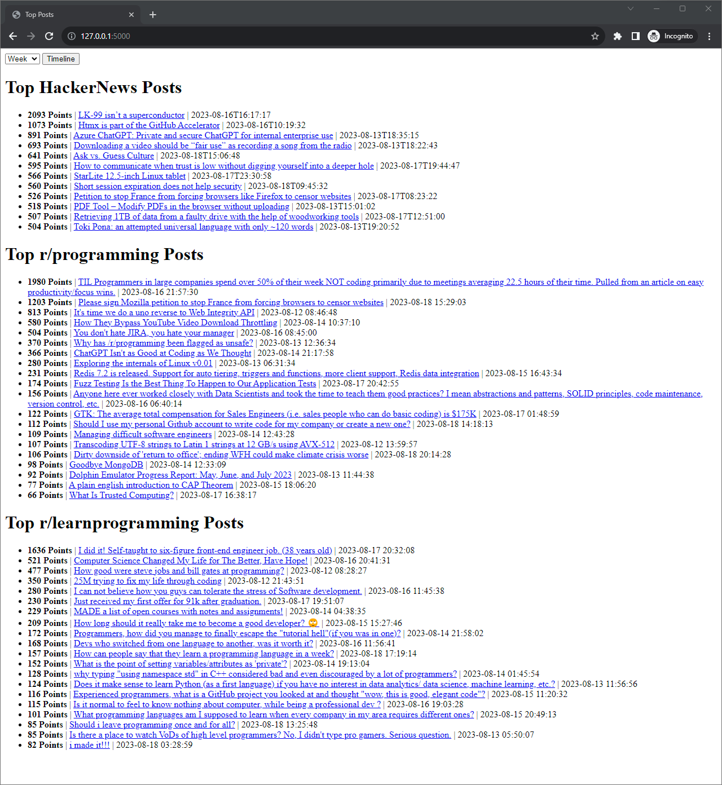
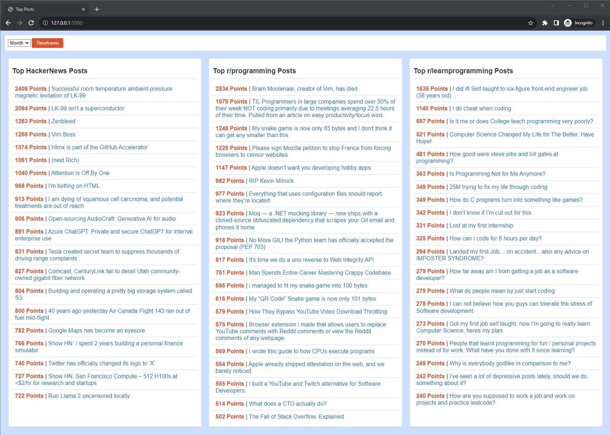

Technologies Used: Python, HTML, CSS, Requests, BeautifulSoup, SQLite, Flask

This web application allows users to select a timeframe and uses Python, Requests, and BeautifulSoup to scrape top posts from HackerNews, r/Programming, and r/LearnProgramming into an SQLite database for each source. These top posts are then displayed in a consolidated manner using HTML/CSS in a Flask frontend.

To use this application, copy the code and install the required packages using `pip install -r requirements.txt` and run `python main.py` to view in a web browser at http://127.0.0.1:5000/.

Updated with with CSS and removed all datetimes for a more modern look:
